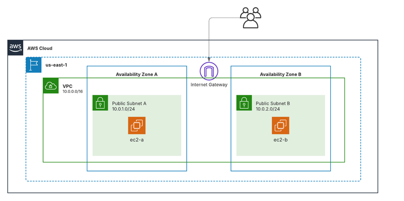

# ☁️ Crea una infraestructura bàsica a AWS utilitzant Terraform

Aquest projecte descriu els requisits per crear una infraestructura bàsica a **AWS** utilitzant **Terraform**.  
Inclou la configuració del proveïdor, la creació d’una VPC, subxarxes públiques, un Internet Gateway, taula de rutes, grup de seguretat i dues instàncies EC2.

---

## 🔧 Proveïdor i regió
➡️ Configura el proveïdor d’**AWS** per treballar a la regió **`us-east-1`**.

---

## 🏗️ VPC
- Crea una **VPC** anomenada **`VPC-03`** amb el bloc d’adreces **`10.0.0.0/16`**.

---

## 🌐 Subxarxes públiques
Dins la VPC, crea **2 subxarxes públiques**:

- 🅰️ **Public Subnet A** a la zona **`us-east-1a`** amb el rang **`10.0.1.0/24`**  
- 🅱️ **Public Subnet B** a la zona **`us-east-1b`** amb el rang **`10.0.2.0/24`**

💡 *Ambdues subxarxes han d’assignar automàticament IPs públiques a les instàncies en el moment del desplegament.*

---

## 🌍 Internet Gateway i taula de rutes
- 🔗 Crea un **Internet Gateway** i associa’l a la VPC.  
- 🧭 Crea una **taula de rutes pública** amb una ruta per defecte que dirigeix el trànsit cap a l’**Internet Gateway**.  
- 🔁 Associa aquesta taula de rutes a totes dues subxarxes públiques.

---

## 🔒 Grup de seguretat
Crea un grup de seguretat que:

- 🔑 Permeti **accés SSH** des de qualsevol lloc.  
- 📡 Permeti **trànsit ICMP** només des de dins de la VPC.  
- 🚀 Permeti **tot el trànsit sortint** cap a qualsevol destinació.

---

## 🖥️ Instàncies EC2
- Llança **2 instàncies EC2** del tipus **`t3.micro`** utilitzant **Amazon Linux**.  
- Cada instància ha d’estar en una **subxarxa pública diferent** (A i B).  
- Ambdues han d’utilitzar el **parell de claus `vockey`** i el **grup de seguretat creat**.  
- 🏷️ Etiqueta les instàncies com **`ec2-a`** i **`ec2-b`**.

---

## 📸 Resultat esperat

