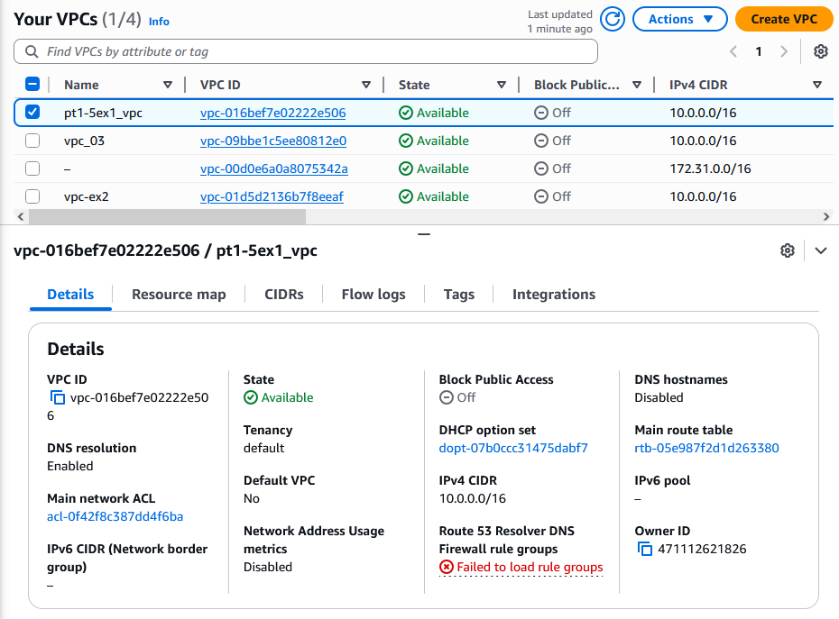
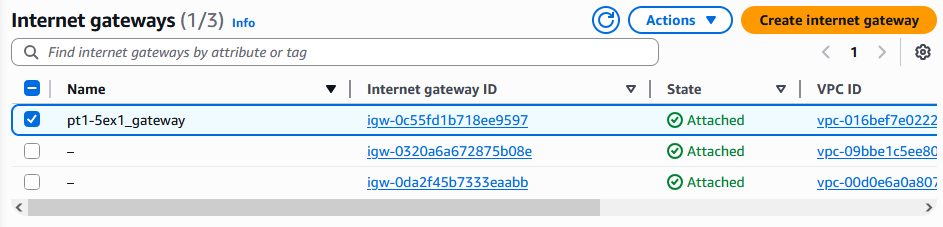
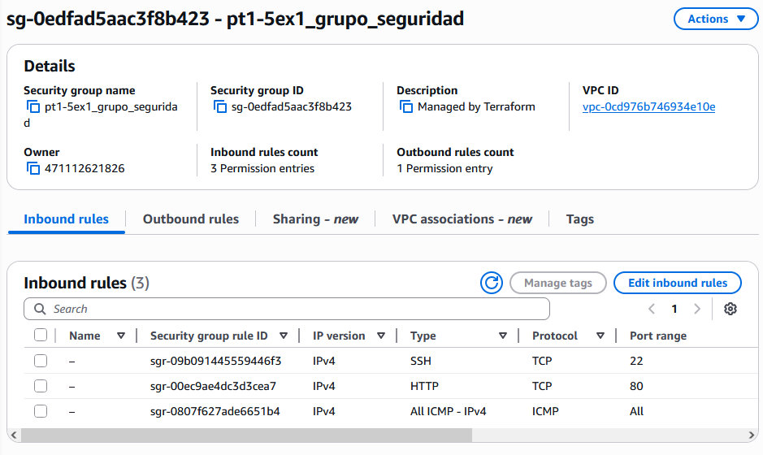
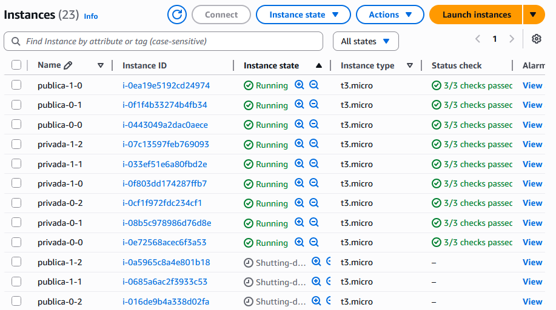

# 💻 Enunciat de l'Exercici de Terraform (AWS)

## Informació de l'Alumne

| Camp | Valor |
| :--- | :--- |
| **Nom i cognoms** | Myrna Prieto Tarbuch |

## 📁 Estructura de Carpetes a GitHub

L'estructura de directoris per a l'exercici ha de ser la següent:
📁 exercicis
├── 📁 pt-1-5
│   ├── 📁 assets
│   │   └── 🖼️ Imatges (opcionales, diagrama de la infraestructura, captures, etc.)
│   ├── 📄 README.md          # Explicació de l'exercici i instruccions pas a pas
│   ├── 📄 main.tf            # Fitxer principal amb els recursos Terraform
│   ├── 📄 variables.tf       # Variables definides per l'exercici
│   ├── 📄 outputs.tf         # Outputs definits per l'exercici
│   └── 📄 provider.tf        # Configuració del provider AWS

---

## 🎯 Instruccions Detallades de l'Exercici

### Pas 1: Configuració Inicial

1.  **Crear un fitxer `variables.tf` amb les següents variables:**

    | Variable | Descripció | Tipus Suggerit | Valor per Defecte (Recomanat) |
    | :--- | :--- | :--- | :--- |
    | `region` | Regió d'AWS. | `string` | `eu-west-3` |
    | `project_name` | Nom del projecte (usat per tags). | `string` | `Projecte-PT-1-5` |
    | `instance_count` | Defineix quantes instàncies per subnet. | `number` | `1` |
    | `subnet_count` | Defineix quantes subnets hi ha per cada tipus (privat i públiques). | `number` | `2` |
    | `instance_type` | El tipus de la instància EC2. | `string` | `t3.micro` |
    | `instance_ami` | Cadena de text representant la imatge d'AWS (AMI ID). | `string` | (ID de la teva regió) |
    | `create_s3_bucket` | Per crear bucket S3 **condicionalment**. | `bool` | `true` |
    | `vpc_cidr` | Xarxa en notació CIDR per la xarxa: `10.0.0.0/16`. | `string` | `10.0.0.0/16` |
    | `my_ip` | Xarxa en notació CIDR que permet connexió SSH. | `string` | `0.0.0.0/0` (o la teva IP) |

2.  **Crear un fitxer `provider.tf`** on es defineixi el proveïdor fent servir la variable `region`.

### Pas 2: Xarxa i Subxarxes

1.  **VPC:** Crear una VPC amb el CIDR definit per la variable `vpc_cidr`.
2.  **Subxarxes:**
    * Crear **2 subxarxes públiques** i **2 subxarxes privades**.
    * Utilitzar `for_each` o `count` basant-se en la variable `subnet_count`.
    * Assignar els blocs CIDR a les subxarxes de manera correcta.
3.  **Gateway:**
    * Crear un Internet Gateway (IGW).
    * Associar-lo a la Taula de Rutes de les subxarxes públiques.

### Pas 3: Instàncies EC2

1.  **Security Group (SG):** Crear un Security Group que defineixi les següents regles d'entrada (`ingress`):
    * **HTTP (Port 80):** Permet des de qualsevol IP (`0.0.0.0/0`).
    * **SSH (Port 22):** Permet només des de la IP de l'institut o casa vostra (`my_ip`).
    * **ICMP:** No permet tràfic ICMP des de cap IP que no sigui interna de la VPC.
    * Permeti tot el tràfic de sortida (`egress`) a qualsevol IP.
2.  **Instàncies:**
    * Crear les instàncies EC2 **públiques** i **privades** utilitzant `count` o `for_each`.
    * Assignar correctament les instàncies a les subxarxes públiques i privades.

### Pas 4: Bucket S3 Condicional

1.  Crear un Bucket S3 **només si** la variable `create_s3_bucket` està activada (`True`).
2.  S'ha d'utilitzar l'argument **`count` amb condicionals** per a la creació.

### Pas 5: Outputs

Crear outputs en el fitxer `outputs.tf` que:

* Retorni les **ID de les instàncies**, amb les seves **IPs públiques** i les seves **IPs privades**.
* Retorni el **nom del bucket s3 creat** en cas que s'hagi creat.

##  Requisits Addicionals

* **Tags:** Afegir **tags** amb el nom del projecte (`project_name`) a **tots els recursos** creats.
* **Comentaris:** Documentar cada recurs amb un comentari explicatiu.
* **Dependències:** Fer servir `depends_on` quan sigui necessari per gestionar dependències explícites.

##  Resultats a la consola de AWS

